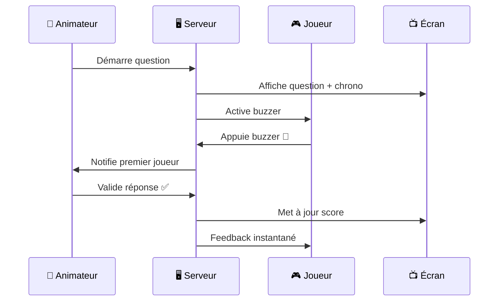
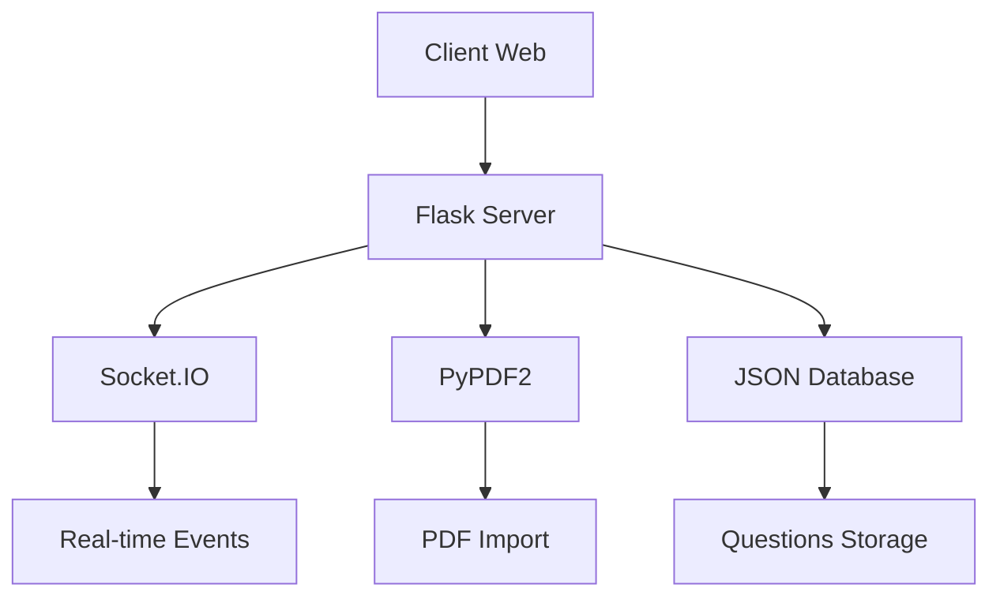

<div align="center">

# 🎯 Question pour un Disciple


[](https://flask.palletsprojects.com/)
[](https://socket.io/)
[](https://python.org)
[](https://railway.app)

</div>

---

## 🎬 Aperçu du Projet

<div align="center">

### 🎮 **Démo Interactive Complète**

<table>
<tr>
<td align="center" width="33%">

**🎯 Console Animateur**
<br/>

<br/>
<sub>Gestion complète du jeu</sub>

</td>
<td align="center" width="33%">

**📱 Interface Joueur**
<br/>

<br/>
<sub>Buzzer temps réel</sub>

</td>
<td align="center" width="33%">

**🖥️ Écran Projection**
<br/>

<br/>
<sub>Affichage public</sub>

</td>
</tr>
</table>

### 🎪 **Flux de Jeu Animé**



### 🚀 **Fonctionnalités en Action**

<div align="center">

| 🎯 **Fonctionnalité** | ⚡ **Temps Réel** | 📱 **Mobile** | 🎪 **Visuel** |
|:---:|:---:|:---:|:---:|
| Buzzer instantané | ✅ Socket.IO | ✅ Responsive | ✅ Animations |
| Chronomètre 20s | ✅ Synchronisé | ✅ Tactile | ✅ Effets sonores |
| Classement live | ✅ Auto-update | ✅ Optimisé | ✅ Podium animé |
| Multi-salles | ✅ Isolées | ✅ QR Code | ✅ URLs dédiées |

</div>

</div>

---

## 🎮 **Essayez Maintenant !**

<div align="center">

### 🌐 **Démo Live**

[](https://question-pour-un-disciple.railway.app)

**Ou créez votre propre salle :**

🎯 **Animateur :** `https://votre-url.com/room/VOTRE_SALLE/admin`  
🎮 **Joueurs :** `https://votre-url.com/room/VOTRE_SALLE/player`  
📺 **Projection :** `https://votre-url.com/room/VOTRE_SALLE/display`

</div>

---

## ⚡ Installation Locale

<details>
<summary>🚀 <strong>Installation en 1 minute</strong></summary>

```bash
# 📥 Cloner le projet
git clone https://github.com/JonathanK-N/question-pour-un-disciple.git
cd question-pour-un-disciple

# 🐍 Environnement Python
python -m venv .venv
.venv\Scripts\activate  # Windows
# source .venv/bin/activate  # Linux/Mac

# 📦 Dépendances
pip install -r requirements.txt

# 🎮 Lancement
python app.py
```

**🌐 Accès :** `http://localhost:5000`

</details>

---

## 🎯 Fonctionnalités Principales

<table>
<tr>
<td width="50%">

### 🎮 **Gameplay Temps Réel**
- 🔴 **Buzzers instantanés** avec Socket.IO
- ⏱️ **Chronomètre 20s** avec effets sonores
- 🏆 **Classement live** et podium animé
- 🔄 **Reconnexion automatique** des joueurs

</td>
<td width="50%">

### 🛠️ **Gestion Avancée**
- 👨💼 **Console animateur** complète
- 📄 **Import PDF** de questionnaires
- 🏠 **Multi-salles** isolées
- 📱 **Interface mobile** responsive

</td>
</tr>
</table>

---

## 🎭 Rôles & Interfaces

<div align="center">

| 👤 **Rôle** | 🔗 **URL** | 📝 **Description** |
|:---:|:---:|:---|
| 🎯 **Animateur** | `/room/<nom>/admin` | Console de contrôle complète |
| 🎮 **Joueur** | `/room/<nom>/player` | Interface de jeu mobile |
| 🖥️ **Projection** | `/room/<nom>/display` | Écran public pour audience |

</div>

> 💡 **Astuce :** Remplacez `<nom>` par votre salle (ex: `/room/sherbrooke`)

---

## 📊 Architecture Technique

<details>
<summary>🏗️ <strong>Stack Technologique</strong></summary>



**Technologies :**
- 🐍 **Backend :** Flask + Flask-SocketIO
- 🎨 **Frontend :** HTML5 + CSS3 + Vanilla JS
- 📄 **PDF :** PyPDF2 pour l'import
- 💾 **Data :** JSON persistant
- 🚀 **Deploy :** Railway compatible

</details>

---

## 📁 Structure du Projet

<details>
<summary>🗂️ <strong>Arborescence détaillée</strong></summary>

```
question-pour-un-disciple/
├── 🐍 app.py                 # Serveur Flask principal
├── 📋 requirements.txt       # Dépendances Python
├── 📊 data/
│   └── 📝 questions.json     # Base de données questions
├── 🎨 static/
│   ├── 📜 script.js          # Logique client
│   ├── 🎨 style.css          # Styles CSS
│   ├── 🔊 buzzer.mp3         # Effets sonores
│   └── 🖼️ assets/           # Images & GIFs
└── 📄 templates/
    ├── 👨💼 admin.html         # Console animateur
    ├── 🖥️ display.html        # Écran projection
    ├── 🎮 player.html         # Interface joueur
    └── 🏠 index.html          # Page d'accueil
```

</details>

---

## 📄 Import PDF

<details>
<summary>📋 <strong>Format des questionnaires</strong></summary>

**Structure attendue :**
```
Question: Qui a écrit l'Apocalypse ?
Réponse: L'apôtre Jean

Question 2 - Quel est le premier miracle de Jésus ?
Réponse 2: L'eau changée en vin à Cana
```

**Formats acceptés :**
- ✅ `Question:` / `Q:` / `Question 1`
- ✅ `Réponse:` / `Reponse:` / `Answer:`
- ✅ Insensible à la casse

</details>

---

## 🛣️ Roadmap

- [ ] 🏆 Mode tournoi éliminatoire
- [ ] ✏️ Éditeur web de questions
- [ ] 📺 Intégration OBS/Chromecast
- [ ] 🌍 Support multilingue
- [ ] 📈 Statistiques avancées
- [ ] 🎵 Thèmes musicaux

---

## 👨💻 Créateur

<div align="center">


**Jonathan Kakesa Nayaba**  
*CEO - Cognito Inc.*

[](https://cognito-inc.ca)
[](mailto:cognito943@gmail.com)
[](https://github.com/JonathanK-N)

*Créateur de solutions numériques pour la communauté chrétienne francophone*

</div>

---

## 📈 Statistiques du Projet

<div align="center">


**⏱️ Temps de développement :** ~120 heures  
**📅 Création :** Septembre 2024  
**🎯 Objectif :** Édifier la communauté chrétienne

</div>

---

## 🙏 Remerciements

<div align="center">

**Merci à l'équipe Jeunes Prodiges Sherbrooke**  
*Pour la vision, les tests et l'énergie communiquée*


*"À Celui qui est puissant pour faire infiniment au-delà de tout ce que nous demandons ou pensons."*  
**— Éphésiens 3:20**

---

⭐ **N'oubliez pas de mettre une étoile si ce projet vous plaît !** ⭐

</div>